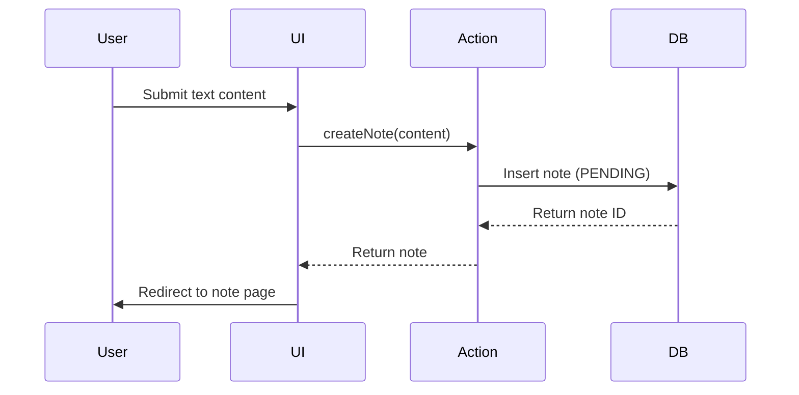
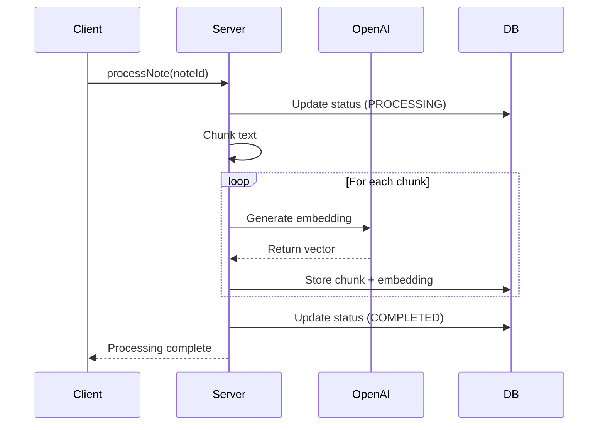
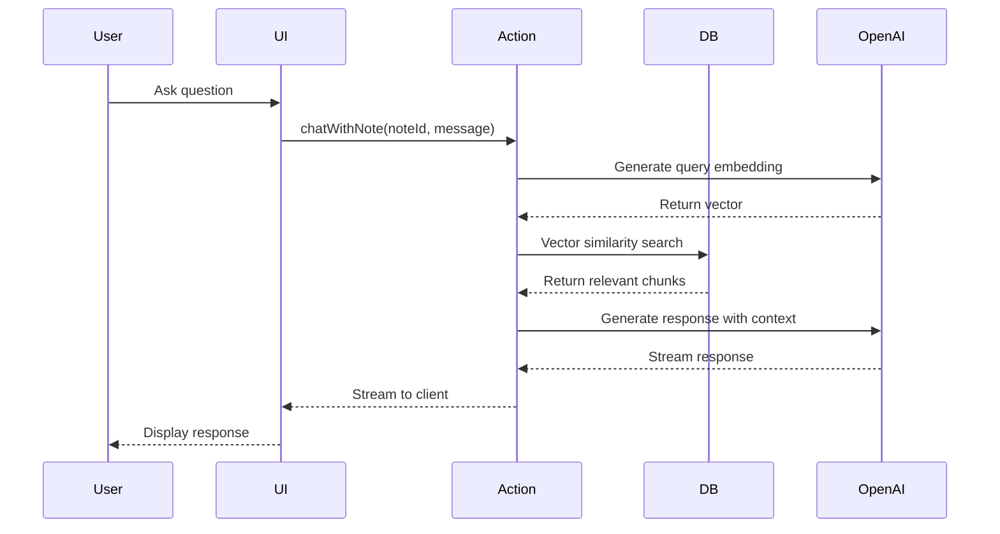

## System Architecture

RAG Chat is built as a modern full-stack application using Next.js 16 with the App Router. It follows a layered architecture pattern with clear separation of concerns.

## Application Layers

### 1. Presentation Layer

**Location**: `app/` directory

- Next.js App Router pages and layouts
- React Server Components for server-side rendering
- Client components for interactivity
- Protected and public route groups

### 2. Business Logic Layer

**Location**: `actions/` directory

Server actions that handle:
- Note CRUD operations
- Text processing orchestration
- Chat interactions
- User authentication

### 3. Data Access Layer

**Location**: Prisma ORM

- Type-safe database queries
- Schema management and migrations
- Vector operations via raw SQL

### 4. Utility Layer

**Location**: `lib/` directory

Shared utilities:
- Authentication helpers
- Text chunking algorithms
- Embedding generation
- Vector operations

## Technology Stack

### Frontend

- **Framework**: Next.js 16 with React 19
- **Styling**: Tailwind CSS v4
- **UI Components**: Custom components with Radix UI primitives
- **State Management**: React hooks and Server State

### Backend

- **Runtime**: Node.js with Next.js API Routes
- **Authentication**: Neon Auth
- **Database**: PostgreSQL with pgvector extension
- **ORM**: Prisma

### AI/ML

- **Embeddings**: OpenAI `text-embedding-3-small`
- **Chat**: OpenAI GPT-4 and Anthropic Claude
- **Framework**: Vercel AI SDK and LangChain
- **RAG Pipeline**: Custom implementation

## Data Flow

### Note Creation Flow



### Processing Flow



### Chat Flow



## Database Schema

### Core Models

```prisma
// User authentication
model User {
  id        String   @id
  email     String   @unique
  notes     Note[]
  createdAt DateTime @default(now())
}

// Note storage
model Note {
  id        String           @id @default(cuid())
  content   String           @db.Text
  status    ProcessingStatus @default(PENDING)
  userId    String
  user      User             @relation(fields: [userId], references: [id])
  chunks    NoteChunk[]
  createdAt DateTime         @default(now())
  updatedAt DateTime         @updatedAt

  @@index([userId])
}

// Vector chunks
model NoteChunk {
  id        String   @id @default(cuid())
  noteId    String
  content   String   @db.Text
  embedding Unsupported("vector(1536)")?
  position  Int
  note      Note     @relation(fields: [noteId], references: [id])

  @@index([noteId])
}

enum ProcessingStatus {
  PENDING
  PROCESSING
  COMPLETED
  FAILED
}
```

## Vector Search Strategy

### pgvector Setup

The application uses PostgreSQL's pgvector extension:

```sql
-- Enable the extension
CREATE EXTENSION IF NOT EXISTS vector;

-- Create index for faster similarity search
CREATE INDEX ON "NoteChunk"
USING ivfflat (embedding vector_cosine_ops)
WITH (lists = 100);
```

### Search Algorithm

1. **Query Embedding**: Convert user question to vector
2. **Cosine Similarity**: Use `<=>` operator for similarity
3. **Top-K Retrieval**: Retrieve top 5 most similar chunks
4. **Context Assembly**: Concatenate chunks as context
5. **LLM Generation**: Pass context to language model

## Scalability Considerations

### Current Scale

- **Users**: Designed for 1-10K concurrent users
- **Notes**: Millions of notes supported
- **Chunks**: Billions of chunks with proper indexing

### Performance Optimizations

1. **Database Indexing**: Strategic indexes on foreign keys and vector columns
2. **Connection Pooling**: Prisma connection pooling for efficient DB access
3. **Edge Runtime**: Deploy to Vercel Edge for low latency
4. **Caching**: Response caching for frequently accessed data
5. **Streaming**: Stream LLM responses for better perceived performance

### Future Enhancements

- **Background Jobs**: Move processing to background queue (Bull, BullMQ)
- **Redis Cache**: Cache embeddings and frequently accessed chunks
- **CDN**: Serve static assets via CDN
- **Load Balancing**: Horizontal scaling with load balancers
- **Sharding**: Database sharding for massive scale

## Security Architecture

### Authentication

- JWT-based authentication via Neon Auth
- HTTP-only cookies for session storage
- CSRF protection with SameSite cookies

### Authorization

- Row-Level Security (RLS) in PostgreSQL
- User-specific data isolation
- Server-side validation for all operations

### Data Protection

- TLS/SSL for data in transit
- Encrypted database connections
- Environment variable management for secrets
- Input sanitization and validation

## Deployment Architecture

### Recommended Setup

```
┌─────────────────────────────────────┐
│         Vercel Platform             │
│  ┌───────────────────────────────┐  │
│  │   Next.js Application         │  │
│  │   - Server Components         │  │
│  │   - API Routes                │  │
│  │   - Server Actions            │  │
│  └───────────┬───────────────────┘  │
└──────────────┼──────────────────────┘
               │
       ┌───────┼───────┐
       │       │       │
       ▼       ▼       ▼
   ┌─────┐ ┌─────┐ ┌─────┐
   │Neon │ │OpenAI│ │Anthro│
   │ DB  │ │ API │ │pic  │
   └─────┘ └─────┘ └─────┘
```

### Infrastructure

- **Hosting**: Vercel (recommended)
- **Database**: Neon Serverless Postgres
- **Authentication**: Neon Auth
- **AI Services**: OpenAI, Anthropic
- **Monitoring**: Vercel Analytics

## Development Workflow

### Local Development

1. Clone repository
2. Install dependencies (`pnpm install`)
3. Set up environment variables
4. Run database migrations
5. Start development server (`pnpm dev`)

### Testing Strategy

- **Unit Tests**: Vitest for utility functions
- **Integration Tests**: Test server actions and API routes
- **E2E Tests**: Playwright for critical user flows
- **Type Safety**: TypeScript for compile-time checks

### CI/CD Pipeline

1. **Code Push**: Developer pushes to GitHub
2. **CI Checks**: Linting, type checking, tests
3. **Preview Deploy**: Vercel preview deployment
4. **Review**: Code review and testing
5. **Production**: Merge to main triggers production deploy
